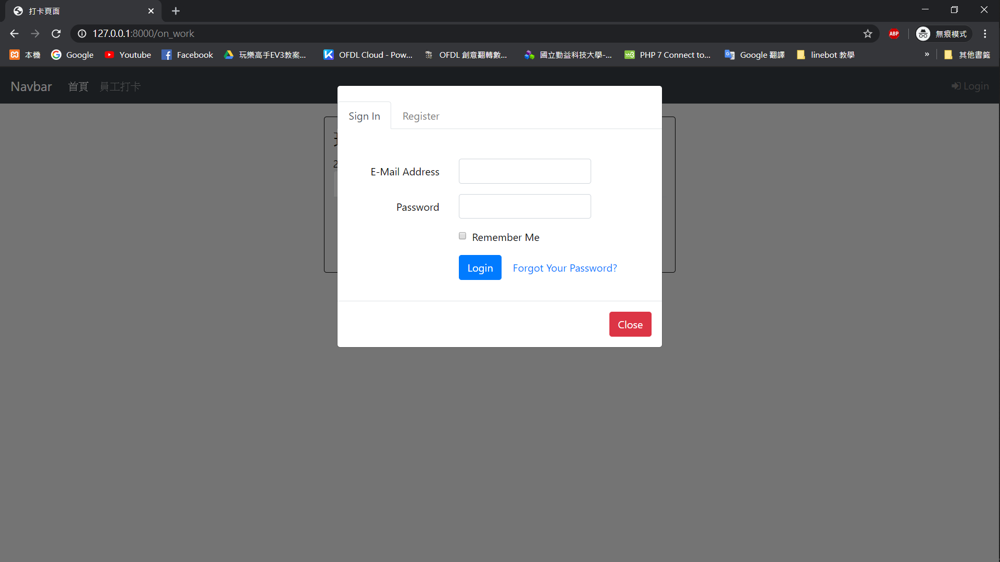
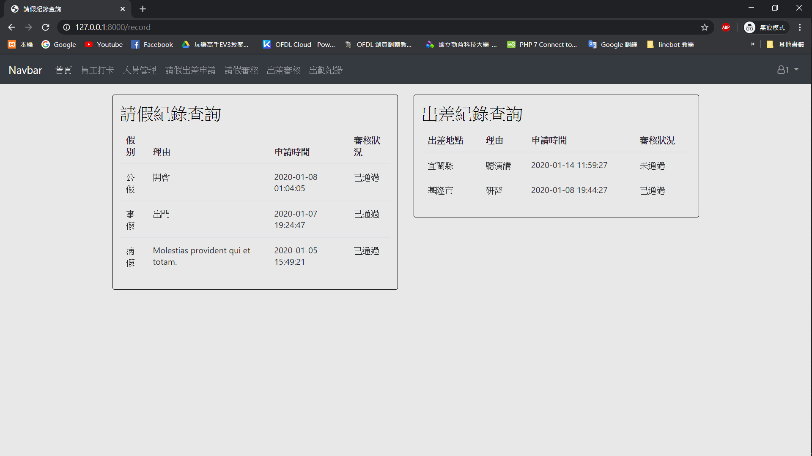

## 首頁

## 使用者登入畫面

## 註冊頁面

## 請假申請頁面

## 請假申請審核頁面

## 出差申請頁面

## 出差申請審核頁面

## 員工打卡頁面

## 出差請假紀錄查詢頁面

## 人員管理頁面

## 出勤紀錄報表頁面

## 系統的作用

人員管理、請假出差、審核請假及出差、出勤記錄報表

- 讓使用者可以清楚自己的出勤狀況
- 讓使用者透過此系統的簡單操作就可以進行請假及出差的申請
- 讓管理者透過此系統的簡單操作就可進行人員的新增修改刪除
- 讓管理者透過此系統的簡單操作就可進行員工的請假及出差的審核

## 系統的主要功能

首頁
- Route::get('/', function () {return view('page');});

請假審核
- 頁面請假審核 [3A632083 王咨淇](https://github.com/3A632083)
    - (Route::get('checkLeave','CheckLeaveController@load_page');)
- 頁面出差審核 [3A632083 王咨淇](https://github.com/3A632083)
    - Route::get('checkTravel','checkTravelController@load_page');
- 請假審核管理者身分驗證 [3A632083 王咨淇](https://github.com/3A632083)
    - Route::get('checkLeaveAuth', ['as' => 'LeaveAuth' , 'uses' => 'AuthController@authenticateLeave']);
- 出差審核管理者身分驗證 [3A632083 王咨淇](https://github.com/3A632083)
    - Route::get('checkTravelAuth', ['as' => 'TravelAuth' , 'uses' => 'AuthController@authenticateTravel']);
- 更新請假審核狀態Status [3A632083 王咨淇](https://github.com/3A632083)
    - Route::post('updateLeaveStatus', "CheckLeaveController@updateLeaveStatus");
- 更新出差審核狀態Status [3A632083 王咨淇](https://github.com/3A632083)
    - Route::post('updateTravelStatus', "checkTravelController@updateTravelStatus");

- 打卡頁面 [3A632097 林品瑀](https://github.com/3A632097)
    - Route::get('on_work', function () {return view('attendance');});
- 打卡頁面傳送資料 [3A632097 林品瑀](https://github.com/3A632097)
    - Route::post('work','InsertController@work')->name('work');

- 申請出差及請假頁面 [3A632062 賴俊霖](https://github.com/3A632062)
    - Route::get('leave', function () { return view('leave'); });
    - Route::post('leave','LeaveTravelController@submit')->name('submit');
    - Route::get('record','LeaveTravelController@record')->name('record')

- 報表 [3A632097 林品瑀](https://github.com/3A632097)
    - Route::get('attend','AttendanceController@attend')->name('attend');

人員新增刪除修改
- 人員開始畫面，倒出所有人員的資料 [3A632097 林品瑀](https://github.com/3A632097)
    - Route::get('/','InsertController@index');
- 人員新增 [3A632097 林品瑀](https://github.com/3A632097)
    - Route::post('/insert','InsertController@insert')->name('insert');
- 人員刪除 [3A632097 林品瑀](https://github.com/3A632097)
    - Route::post('/delete','InsertController@delete')->name('delete');
- 人員修改 [3A632097 林品瑀](https://github.com/3A632097)
    - Route::post('/update','InsertController@update')->name('update');

## 初始專案與DB負責的同學
- 初始專案  [3A632062 賴俊霖](https://github.com/3A632062)
- 資料庫及資料表建立、資料表關連 [3A632097 林品瑀](https://github.com/3A632097) [3A632083 王咨淇](https://github.com/3A632083) [3A632062 賴俊霖](https://github.com/3A632062)

## 額外使用的套件或樣板 

## 系統復原步驟

複製https://github.com/WISD-2019/final04.git本系統在GitHub的專案，打開 Source tree，點選 Clone 後，輸入以下資料

Source Path:https://github.com/WISD-2019/final04.git Destination Path:C:\wagon\uwamp\www\final04 打開cmder，切換至專案所在資料夾，cd final04

- 在cmder輸入以下命令，以復原此系統：
    - composer install 
    - composer run‐script post‐root‐package‐install 
    - composer run‐script post‐create‐project‐cmd 
    
- 將專案打開 在.env檔案內輸入資料庫主機IP、Port、名稱、與帳密如下：

    - DB_HOST=127.0.0.1

    - DB_PORT=33060

    - DB_DATABASE=final04

    - DB_USERNAME=root

    - DB_PASSWORD=root
    
- 復原完，建立資料庫
    - 先進Adminer建立final04的資料庫
    - 建立好之後開啟cmder輸入以下指令： artisan migrate(成功執行後會復原所有資料表)
    - artisan db:seed(建立假資料)
- 進入adminer
   - 資料庫系統:MYSQL

   - 伺服器:localhost:33060

   - 帳號:root

   - 密碼:root

在UwAmp下，點選Apache config，選擇port 8000 ，並在Document Root 輸入{DOCUMENTPATH}/final04/public
## 系統使用帳號
- 後台管理者(type：1)
    - 帳號：1@gmail.com
    - 密碼：123456
- 前台使用者(type：0)
    - 帳號：12@gmail.com
    - 密碼：123456
## 系統開發人員
- **[3A632062 賴俊霖](https://github.com/3A632062)**
- **[3A632083 王咨淇](https://github.com/3A632083)**
- **[3A632097 林品瑀](https://github.com/3A632097)**
